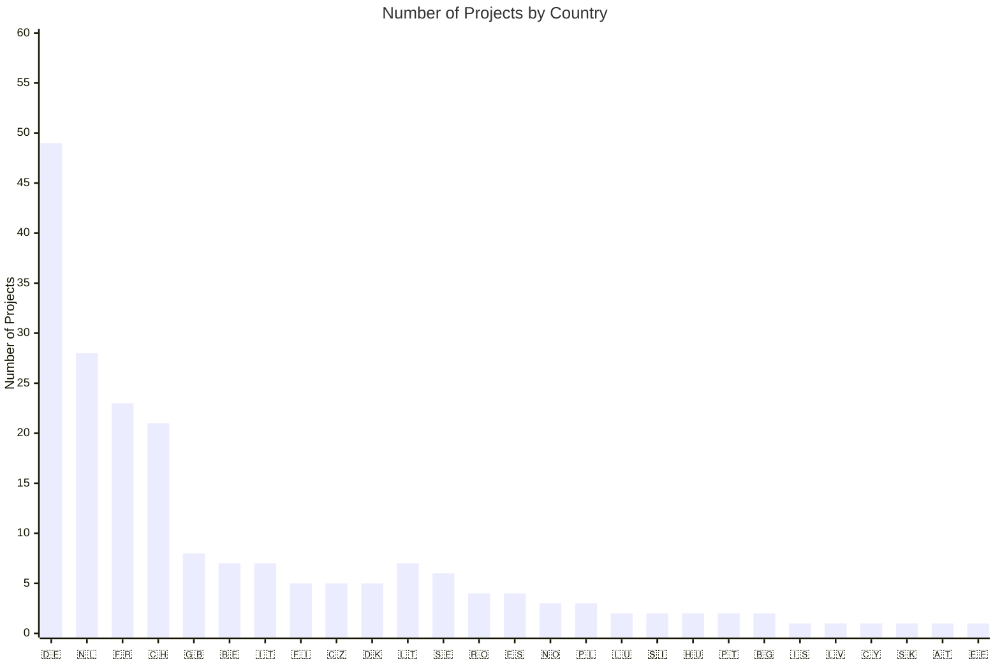

  
  <h2 style="margin-top: 5px;">Awesome European Tech</h2>
  

    
    
    
    
  

## Overview

**An up-to-date list of recommended European projects and companies, curated by the community to support and strengthen the European tech ecosystem, specifically for users interested in privacy and sustainability.**

European software and companies often adhere to unique standards that provide significant benefits to users. These standards not only enhance user experience but also set a global benchmark for innovation, privacy, and sustainability. For example:

- **GDPR Compliance**: European companies are required to comply with the General Data Protection Regulation (GDPR), which ensures stricter data privacy and security for users compared to many other regions, including the U.S. This regulation has become a global gold standard for data protection.

- **Sustainability Standards**: Many European companies prioritize eco-friendly practices, such as utilizing renewable energy, reducing carbon emissions, and adopting circular economy principles. These efforts align with the EU’s ambitious Green Deal initiatives, making them leaders in sustainable innovation.
---
## Acceptance Criteria

1. **Compliance**: Must adhere to GDPR, UK GDPR, Swiss FADP, or other relevant European data protection frameworks.
2. **European Headquarters**: The company or project must be based in Europe.
3. **Technology Focus** Must be a company or project that leverages technology as a core component of its operations, products, or services.

---
## Disclaimer

This project is not about excluding non-European products or tools. There are countless exceptional global solutions that are widely used and appreciated. The purpose of this list is to highlight and support European startups and projects that excel in areas like privacy, sustainability, and innovation. By doing so, we aim to strengthen the European tech ecosystem while fostering collaboration and inclusivity across borders. Together, we can contribute to a more diverse, resilient, and interconnected global tech landscape.

Before exploring the list, we encourage you to visit the website that inspired this project: [European Alternatives](https://european-alternatives.eu/). 

---
## Contribute

Any contributions you make are **greatly appreciated**. If you have a suggestion that would make this better, please fork the repo and create a pull request. You can also simply open an issue with the tag "enhancement". Thanks again! ❤️

---
## Index
- [AI](#ai)
- [Browsers](#browsers)
- [CDN](#cdn)
- [Cloud](#cloud)
- [Communication Tools](#communication-tools)
- [Cybersecurity](#cybersecurity)
- [Database Management Systems](#database-management-systems)
- [Design and Creative Tools](#design-and-creative-tools)
- [DNS](#dns)
- [Domain Name Registrars](#domain-name-registrars)
- [E-commerce Platforms](#e-commerce-platforms)
- [FinTech](#fintech)
- [Hardware](#hardware)
- [IDEs](#ides)
- [Mail Providers](#mail-providers)
- [Marketing Tools](#marketing-tools)
- [Music and Travel](#music-and-travel)
- [Navigation Apps](#navigation-apps)
- [Network Tools and Apps](#network-tools-and-apps)
- [Operating Systems (OS)](#operating-systems-os)
- [Password Manager Services](#password-manager-services)
- [Productivity Tools](#productivity-tools)
- [Search Engine](#search-engine)
- [Sustainability and Recycling](#sustainability-and-recycling)
- [Translation Services](#translation-services)
- [VPS](#vps)
- [VPN](#vpn)
- [Web Analytics](#web-analytics)
- [Quantum Computing](#quantum-computing)

---

### AI
- [Cradle.bio](https://www.cradle.bio/) 🇳🇱 - AI-driven protein engineering for synthetic biology.
- [Gcore](https://gcore.com/) 🇱🇺 - Edge AI, cloud, and content delivery solutions.
- [Leya](https://www.leya.law/) 🇸🇪 - AI-powered legal research and contract analysis platform.
- [Mistral AI](https://mistral.ai/) 🇫🇷 - Open-source AI models for developers and enterprises.
- [Suse](https://www.suse.com/solutions/ai/) 🇩🇪 - Enterprise-grade AI/ML solutions for open-source environments.
- [Next Epoch](https://nextepoch.ai/) 🇳🇱 - AI platform for developing and managing AI agents with full data sovereignty.
- [Timefold](https://timefold.ai/) 🇧🇪 - Planning AI / constraint solver for optimization problems

### Browsers
- [Falkon](https://www.falkon.org/) 🇩🇪 - Lightweight Qt-based browser
- [Mullvad](https://mullvad.net/en/download/browser/linux) 🇸🇪 - Privacy-focused browser
- [Otter Browser](https://otter-browser.org/) 🇵🇱
- [Vivaldi](https://vivaldi.com/) 🇮🇸

### CDN
- [Bunny CDN](https://bunnycdn.com) 🇸🇮
- [CDN77](https://www.cdn77.com/) 🇨🇿 Content delivery network based in the Czech Republic.
- [KeyCDN](https://www.keycdn.com) 🇨🇭
- [Leaseweb CDN](https://www.leaseweb.com/cdn) 🇳🇱
- [Myra CDN](https://www.myra-security.com/en/cdn) 🇩🇪
- [OVHcloud CDN](https://www.ovhcloud.com/en/cdn/) 🇫🇷

### Cloud
- [Aruba](https://www.aruba.it) 🇮🇹 - Cloud hosting and data center services.
- [Cozy](https://www.cozy.io) 🇫🇷 - Privacy-first personal cloud for data management.
- [datacrunch](https://datacrunch.io/) 🇫🇮 - GPU cloud computing for AI/ML workloads.
- [Elastx](https://www.elastx.se) 🇸🇪 - Managed cloud hosting with a focus on sustainability.
- [Exoscale](https://www.exoscale.com) 🇨🇭 - Scalable cloud infrastructure for developers.
- [Filen](https://www.filen.io) 🇩🇪 - End-to-end encrypted cloud storage.
- [Fuga Cloud](https://www.fuga.cloud) 🇳🇱 - OpenStack-based public cloud platform.
- [gridscale](https://www.gridscale.io) 🇩🇪 - Flexible IaaS and PaaS solutions.
- [Infomaniak kDrive](https://www.infomaniak.com/en/kdrive) 🇨🇭 - Cloud storage with collaboration tools.
- [Internxt](https://www.internxt.com) 🇪🇸 - Decentralized cloud storage prioritizing privacy.
- [IONOS](https://www.ionos.com) 🇩🇪 - Comprehensive cloud and web hosting services.
- [Jottacloud](https://www.jottacloud.com) 🇳🇴 - Cloud backup and file storage.
- [Koofr](https://www.koofr.eu) 🇸🇮 - Secure cloud storage with multi-provider integration.
- [Nextcloud](https://nextcloud.com/) 🇩🇪 - Self-hosted collaboration and file-sharing platform.
- [Open Telekom Cloud](https://open-telekom-cloud.com) 🇩🇪 - Enterprise cloud services by Deutsche Telekom.
- [OVHcloud](https://www.ovhcloud.com) 🇫🇷 - Global cloud provider with bare-metal servers.
- [pCloud](https://www.pcloud.com/) 🇨🇭 - Lifetime encrypted cloud storage plans.
- [Proton Drive](https://www.proton.me/drive) 🇨🇭 - Secure cloud storage from Proton.
- [Scaleway](https://www.scaleway.com) 🇫🇷 - Developer-friendly cloud and bare-metal solutions.
- [Seeweb](https://www.seeweb.it) 🇮🇹 - High-performance Italian cloud hosting.
- [STACKIT](https://www.stackit.de) 🇩🇪 - Cloud platform for businesses.
- [Tresorit](https://tresorit.com/) 🇨🇭 - End-to-end encrypted file sharing for enterprises.
- [UpCloud](https://www.upcloud.com) 🇫🇮 - High-speed cloud infrastructure with maxIOPS.

### Communication Tools
- [Alugha](https://alugha.com/) 🇩🇪 - Multilingual video hosting platform.
- [Element (Matrix)](https://element.io/) 🇬🇧 - Secure messaging via the Matrix protocol.
- [Ginlo](https://www.ginlo.net/) 🇩🇪 -Secure messaging app.
- [Jitsi](https://jitsi.org/) 🇫🇷 - Open-source video conferencing and chat.
- [Mastodon](https://joinmastodon.org/) 🇩🇪 -  Open-source decentralized social network.
- [Olvid](https://www.olvid.io) 🇫🇷 - Privacy-first messaging with zero metadata.
- [Pleroma](https://pleroma.social/) 🇩🇪 - Open-source social networking software.
- [SKRED](https://www.skred.io) 🇳🇴 - Secure communication app.
- [Sproof](https://www.sproof.io/) 🇩🇪 - Digital signature and document management service.
- [Stackfield](https://www.stackfield.com/) 🇩🇪 - Cloud storage and collaboration service.
- [TeamViewer](https://www.teamviewer.com/) 🇩🇪 - Remote access and support software company.
- [TeleGuard](https://www.teleguard.com) 🇨🇭 - Encrypted messaging and calls.
- [Threema](https://www.threema.ch) 🇨🇭 - End-to-end encrypted messaging for privacy.
- [Wire](https://wire.com/) 🇨🇭 - Secure enterprise communication platform.

### Cybersecurity
- [Bitdefender](https://www.bitdefender.com/) 🇷🇴 - Cybersecurity and antivirus software company.
- [IPXO](https://www.ipxo.com/) 🇱🇹 - The network platform for IPv4 leasing, management, threat intelligence, and IPv6 capabilities.

### Database Management Systems
- [DuckDB](https://duckdb.org/) 🇳🇱 - An in-process SQL OLAP database management system.

### Design and Creative Tools
- [Blender Foundation](https://www.blender.org/) 🇳🇱 - Open-source 3D creation suite for modeling, animation, and more.
- [VectorStyler](https://www.vectorstyler.com/) 🇭🇺 - vector graphics editor.
- [Photopea](https://www.photopea.com/) 🇨🇿 - online photo editor.
- [Penpot](https://penpot.app/) 🇪🇸 - Open-source design tool that bridges the gap between designers and developers.

### DNS
- [Bunny DNS](https://bunny.net/dns) 🇸🇮
- [ClouDNS](https://www.cloudns.net) 🇧🇬
- [deSEC](https://www.desec.io) 🇩🇪
- [EuroDNS DNS](https://www.eurodns.com) 🇱🇺
- [Exoscale DNS](https://www.exoscale.com/dns) 🇨🇭
- [Hostinger](https://www.hostinger.com/) 🇱🇹
- [RcodeZero](https://www.rcodezero.at) 🇦🇹
- [Scaleway DNS](https://www.scaleway.com/dns) 🇫🇷
- [Quad9](https://quad9.net/) 🇨🇭

### Domain name registrars
- [Aruba Domains](https://www.aruba.it) 🇮🇹
- [Combell Domains](https://www.combell.com) 🇧🇪
- [Gandi](https://www.gandi.net) 🇫🇷
- [Hostinger Domain](https://www.hostinger.com) 🇱🇹
- [Hostpoint Domains](https://www.hostpoint.ch) 🇨🇭
- [Infomaniak Domains](https://www.infomaniak.com/en/domains) 🇨🇭
- [inwx](https://www.inwx.com) 🇩🇪
- [IONOS domains](https://www.ionos.com) 🇩🇪
- [netim](https://www.netim.com) 🇫🇷
- [Openprovider](https://www.openprovider.com) 🇳🇱
- [OVHcloud Domains](https://www.ovhcloud.com) 🇫🇷
- [United Domains](https://www.uniteddomains.com) 🇩🇪

### E-commerce Platforms
- [Mollie](https://www.mollie.com/) 🇳🇱 - Payment gateway for seamless online transactions.
- [Omnisend](https://www.omnisend.com/) 🇱🇹 - An e-commerce marketing automation platform.
- [PrestaShop](https://www.prestashop.com/) 🇫🇷 - Open-source e-commerce platform.
- [Shopware](https://www.shopware.com/) 🇩🇪 - Modern e-commerce solutions for businesses.
- [Shoperb](https://www.shoperb.com/) 🇵🇱 -  e-commerce platform.
- [Vinted](https://www.vinted.com/) 🇱🇹 - An online marketplace for second-hand fashion.
- [Wolt](https://wolt.com/) 🇫🇮 - Food delivery service. (Now owned by US-based DoorDash.)

### FinTech
- [Adyen](https://www.adyen.com/) 🇳🇱 - Global payment processing for businesses.
- [FintechOS](https://www.fintechos.com/) 🇷🇴 - Company providing digital transformation for financial institutions.
- [Klarna](https://www.klarna.com/) 🇸🇪 - Buy now, pay later shopping solutions.
- [Monzo](https://monzo.com/) 🇬🇧 - digital bank.
- [N26](https://n26.com/) 🇩🇪 - Mobile-first banking with no hidden fees.
- [Revolut](https://www.revolut.com/) 🇬🇧 - Digital banking and currency exchange app.
- [Smartbill](https://www.smartbill.ro/) 🇷🇴 - Fintech company offering billing solutions.
- [Starling Bank](https://www.starlingbank.com/) 🇬🇧 - Digital challenger bank.
- [Wise (ex TransferWise)](https://wise.com/) 🇬🇧 - Low-cost international money transfers.

### Hardware
- [ASML](https://www.asml.com/) 🇳🇱 - Company specializing in photolithography systems for the semiconductor industry.
- [Axelera](https://www.axelera.ai) 🇳🇱 - AI acceleration hardware for edge computing.
- [Raspberry Pi](https://www.raspberrypi.com/) 🇬🇧 - Affordable single-board computers for DIY projects.
- [Recogni](https://www.recogni.com/) 🇩🇪 - Company focusing on AI-powered vision processing for autonomous systems.
- [Kalray](https://www.kalrayinc.com/) 🇫🇷 - Company developing processors for data centers and AI.
- [Sipearl](https://www.sipearl.com/) 🇫🇷 - Company developing microprocessors for high-performance computing (HPC), particularly for the European Processor Initiative (EPI).
- [Prowise](https://www.prowise.com/) 🇳🇱 - An European ed tech company that ensures the highest quality requirements and certifications in terms of privacy, security and safety.

### IDEs
- [BlueJ](https://www.bluej.org/) 🇬🇧 - Java IDE for education and beginners.
- [Geany](https://www.geany.org/) 🇩🇪 - Lightweight IDE for multiple programming languages.
- [JetBrains](https://www.jetbrains.com/) 🇨🇿 - Developer tools and IDEs for efficient coding.

### Mail Providers
- [Disroot](https://disroot.org/en/services/email) 🇳🇱 - Privacy-focused email with open-source tools.
- [Mailbox.org](https://mailbox.org/) 🇩🇪 - Secure email with ad-free productivity suites.
- [Mailfence](https://www.mailfence.com/) 🇧🇪 - Encrypted email and document collaboration.
- [Posteo](https://posteo.de/) 🇩🇪 - Eco-friendly email with strong privacy.
- [ProtonMail](https://proton.me/mail) 🇨🇭 - Secure email with end-to-end encryption.
- [Runbox](https://runbox.com/) 🇳🇴 - Email provider with privacy focus.
- [Tutanota](https://tutanota.com/) 🇩🇪 - Encrypted email and calendar service.

### Marketing Tools
- [Keila](https://www.keila.io) 🇩🇪 - Open Source email newsletter tool.

### Music and Travel
- [Bolt](https://bolt.eu/) 🇪🇪 - Mobility company offering ride-hailing and other services.
- [Spotify](https://www.spotify.com/) 🇸🇪 - Audio streaming and media services provider.
- [Trivago](https://www.trivago.com/) 🇩🇪 - Travel fare aggregator and travel metasearch engine.

### Navigation apps
- [HERE WeGo Maps & Navigation](https://wego.here.com) 🇳🇱
- [komoot](https://www.komoot.com) 🇩🇪
- [Magic Earth](https://www.magicearth.com) 🇭🇺
- [Mapy.cz](https://www.mapy.cz) 🇨🇿
- [OsmAnd](https://osmand.net) 🇨🇿
- [Organic Maps](https://organicmaps.app) 🇨🇾
- [Sygic GPS Navigation](https://www.sygic.com) 🇸🇰
- [TomTom GO Navigation](https://www.tomtom.com) 🇳🇱

### Network Tools and Apps
- [IPXO](https://www.ipxo.com/) 🇱🇹 - The network platform for IPv4 leasing, management, threat intelligence, and IPv6 capabilities.

### Operating Systems (OS)
- [Canonical (Ubuntu)](https://canonical.com/) 🇬🇧 - Ubuntu Linux distribution and services.
- [KDE (Plasma Desktop)](https://kde.org/) 🇩🇪 - Customizable desktop environment for Linux.
- [SUSE](https://www.suse.com/) 🇩🇪 - Enterprise-grade Linux distribution.
- [UBports (Ubuntu Touch)](https://ubports.com/) 🇩🇪 - Mobile OS based on Ubuntu.

### Password manager services
- [heylogin](https://www.heylogin.com) 🇩🇪
- [Hypervault](https://www.hypervault.com) 🇧🇪
- [Padloc](https://padloc.app) 🇩🇪
- [Passbolt](https://www.passbolt.com) 🇫🇷
- [Password Depot](https://www.password-depot.com) 🇩🇪
- [pCloud Pass](https://www.pcloud.com/pass) 🇨🇭
- [Proton Pass](https://proton.me/pass) 🇨🇭
- [uniqkey](https://www.uniqkey.com) 🇩🇰

### Productivity Tools
- [CryptPad](https://cryptpad.fr/) 🇫🇷 - End-to-end encrypted collaboration suite.
- [Formbricks](https://formbricks.com/) 🇩🇪 - Open-source survey and feedback tool.
- [Joplin](https://joplinapp.org/) 🇫🇷 - Note-taking app with sync and encryption.
- [LibreOffice](https://www.libreoffice.org/) 🇩🇪 - Free and open-source office suite.
- [OnlyOffice](https://www.onlyoffice.com/) 🇱🇻 - Collaborative office suite for teams.

### Quantum Computing
- [QBLOX](https://www.qblox.com/) 🇳🇱 - Qubit agnostic control electronics.
- [Orange Quantum Systems](https://orangeqs.com/) 🇳🇱 - Solutions testing and integration.
- [QuantWare](https://www.quantware.com/) 🇳🇱 - Design and manufacture of superconducting hardware.
- [QphoX](https://qphox.eu/) 🇳🇱 - Design and manufacture of optical modems.

### Search engine
- [Ecosia](https://www.ecosia.org) 🇩🇪 - Carbon-neutral search engine planting trees.
- [Qwant](https://www.qwant.com) 🇫🇷 - Privacy-respecting search engine from France.
- [Startpage](https://www.startpage.com) 🇳🇱 - Private search with Google results.
- [Swisscows](https://www.swisscows.com) 🇨🇭 - Family-friendly search engine with no tracking.

### Sustainability and Recycling
- [Cylib](https://www.cylib.com/) 🇩🇪 - startup Focusing on lithium-ion battery recycling
- [Dembrane](https://www.dembrane.com/) 🇩🇰 - Company specializing in sustainable membrane technology.
- [Orbisk](https://orbisk.com/) 🇳🇱 - AI-powered tools to reduce food waste.

### Translation services
- [DeepL](https://www.deepl.com) 🇩🇪 - AI-powered translation with high accuracy.
- [eTranslation](https://ec.europa.eu/cefdigital/wiki/display/ETRANSLATION/eTranslation) 🇧🇪
- [ModernMT](https://www.modernmt.com) 🇮🇹 - Adaptive machine translation for enterprises.
- [Reverso](https://www.reverso.net) 🇫🇷 - Context-aware translation and language tools.
- [Textshuttle](https://www.textshuttle.ai) 🇨🇭 - AI-driven translation for businesses.
- [Unbabel](https://unbabel.com/) 🇵🇹
- [Widn.ai](https://www.widn.ai/) 🇵🇹

### VPS
- [AlphaVPS](https://www.alphavps.com) 🇧🇬
- [Aruba Cloud](https://www.arubacloud.com) 🇮🇹
- [cloudscale](https://www.cloudscale.ch) 🇨🇭
- [Combell Cloud](https://www.combell.com/en/cloud) 🇧🇪
- [Contabo](https://www.contabo.com) 🇩🇪
- [Hetzner](https://www.hetzner.com) 🇩🇪
- [NordVPN](https://nordvpn.com/) 🇱🇹
- [netcup](https://www.netcup.eu) 🇩🇪
- [Scaleway](https://www.scaleway.com) 🇫🇷
- [Surfshark](https://surfshark.com/) 🇱🇹
- [Tilaa](https://www.tilaa.com) 🇳🇱
- [V.PS](https://www.v.ps) 🇳🇱
- [Virtua.Cloud](https://www.virtua.cloud) 🇫🇷
- [Webdock](https://www.webdock.io) 🇩🇰

### VPN
- [AirVPN](https://www.airvpn.org) 🇮🇹 - Privacy-focused VPN with open-source ethos.
- [F‑Secure FREEDOME VPN](https://www.f-secure.com) 🇫🇮 - VPN with malware blocking.
- [Mullvad VPN](https://www.mullvad.net) 🇸🇪 - No-logs VPN with anonymous accounts.
- [GOOSE VPN](https://www.goosevpn.com) 🇳🇱 - Dutch VPN provider with no-log policy.
- [OctoVPN](https://www.octovpn.com) 🇩🇰 - High-performance gaming VPN with DDoS protection.
- [Xeovo](https://www.xeovo.com) 🇫🇮 - Privacy-focused VPN with anonymous payments.

### Web Analytics
- [Alceris](https://www.alceris.com) 🇫🇷 - AI-driven analytics for web performance and SEO.
- [Analyzati](https://analyzati.com) 🇪🇸 - Privacy-friendly web analytics for businesses.
- [Counter](https://counter.com) 🇳🇱 - Lightweight, open-source web analytics.
- [digistats](https://digistats.io) 🇩🇪 - Analytics with real-time tracking.
- [Dreamdata](https://www.dreamdata.io) 🇩🇰 - B2B revenue attribution and data platform.
- [etracker](https://www.etracker.com) 🇩🇪 - Visitor analytics and heatmaps.
- [fusedeck](https://fusedeck.com) 🇨🇭 - Swiss real-time tracking and analytics.
- [Friendly Analytics](https://friendlyanalytics.com) 🇨🇭 - Open-source and privacy-focused analytics.
- [Insights](https://insights.ai) 🇳🇱 - AI-driven data analytics and reporting.
- [Matomo by Stackhero](https://www.stackhero.io) 🇫🇷 - Managed Matomo analytics hosting.
- [Mouseflow](https://www.mouseflow.com) 🇩🇰 - Session replay and heatmaps for UX analysis.
- [nilly](https://nilly.com) 🇧🇪 - Privacy-first analytics with simple dashboards.
- [Offen](https://offen.dev) 🇩🇪 - Self-hosted web analytics with user-first privacy.
- [Pirsch](https://pirsch.io) 🇩🇪 - Simple, cookie-free, and GDPR-compliant analytics.
- [Publytics](https://publytics.com) 🇮🇹 - SEO and performance monitoring analytics.
- [SEAL Metrics](https://sealmetrics.com) 🇪🇸 - Cookieless web analytics for GDPR compliance.
- [Sitesights](https://sitesights.com) 🇩🇪 - privacy-friendly analytics.
- [Stormly](https://stormly.com) 🇳🇱 - AI-powered business intelligence platform.
- [Swetrix](https://swetrix.com) 🇺🇦 - Lightweight analytics with real-time tracking.
- [TelemetryDeck](https://telemetrydeck.com) 🇩🇪 - Privacy-first telemetry for apps.
- [tinylytics](https://tinylytics.com) 🇳🇱 - Simple web analytics for indie developers.
- [Vantevo](https://vantevo.com) 🇮🇹 - Analytics with real-time insights.
- [Visitor Analytics](https://www.visitor-analytics.io) 🇷🇴 - Website analytics and behavior tracking.
- [Wide Angle Analytics](https://wideangleanalytics.com) 🇵🇱 - Privacy-first analytics with EU data hosting.
